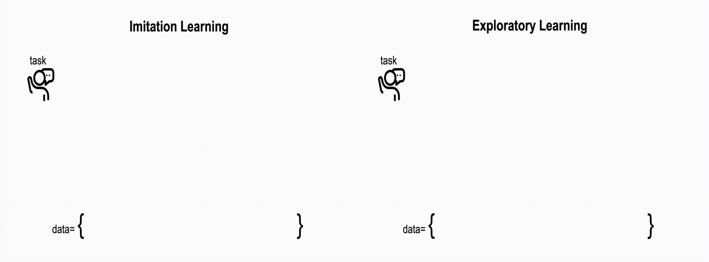

# ExACT: Teaching AI Agents to Explore with Reflective-MCTS and Exploratory Learning

<!-- [[Website]](https://agent-e3.github.io/rmcts-exploratory-learning/) -->
<!-- [[arXiv]](https://arxiv.org/abs/2410.02052) -->

We present R-MCTS and Exploratory Learning for building o1-like models for agentic applications. Our **R-MCTS agent** extends traditional MCTS by 1) incorporating contrastive reflection, allowing agents to learn from past interactions and dynamically improve their search efficiency; and 2) using multi-agent debate to provide reliable state evaluation.

<!--  -->

**Exploratory Learning** is a novel learning strategy that trains the models to explore the environment, evaluate a state, and backtrack to viable ones when it detects that the current state cannot lead to success. Our GPT-4o powered R-MCTS agent creates SOTA performance on VisualWebArena. Notably, R-MCTS and Exploratory Learning demonstrate the compute scaling properties in both training and testing time.

<!--  -->

> You are currently at the branch that contains code for running VisualWebArena tasks. To run on OSWorld, please switch to the other branch.

# Setup

1. Install VWA repo, and follow its instruction of setting up websites (using either AWS or Docker)
2. export environment variables. In total, you will need the following set of environment variables:
      ```bash
      ##### VLM providers
      export OPENAI_API_KEY=sk-xxx
      export OPENAI_ORGANIZATION=org-xxx
      export HF_TOKEN=hf_xxx
      # optional keys (other providers)
      export AZURE_OPENAI_API_BASE=https://xxx
      export AZURE_TOKEN_PROVIDER_API_BASE=https://xxx

      ##### (V)WA Web URLs
      export DATASET="<visualwebarena or webarena>"
      export CLASSIFIEDS="<your_classifieds_domain>:9980"
      export CLASSIFIEDS_RESET_TOKEN="4b61655535e7ed388f0d40a93600254c"  # Default reset token for classifieds site, change if you edited its docker-compose.yml
      export SHOPPING="<your_shopping_site_domain>:7770"
      export REDDIT="<your_reddit_domain>:9999"
      export WIKIPEDIA="<your_wikipedia_domain>:8888"
      export SHOPPING_ADMIN="<your_e_commerce_cms_domain>:7780/admin"
      export GITLAB="<your_gitlab_domain>:8023"
      export MAP="<your_map_domain>:3000"
      export HOMEPAGE="<your_homepage_domain>:4399"
      ```
3. generate task configs (intent and evaluation config) with:
      ```bash
      # generate VWA task configs
      export DATASET=visualwebarena
      python runners/utils/generate_test_configs.py
      # generate WA task configs
      export DATASET=webarena
      python runners/utils/generate_test_configs.py
      ```
4. launch our (V)WA Management server for an easy way to reset/monitor your docker envs. APIs from this server is also used to **automate environment resetting after evaluations**. This is especially useful if your environment/agent is running on different machines.

      <!-- On a high level, if your environment in running on machine `X`, then you should run the management server on machine `X` so that it can reset the environment (using bash scripts) even if the agent is running on a different machine `Y`. -->
      On a high level, the idea is to run this management server on the same machine where your environment is running, which will use bash scripts under `runners/utils/vwa_mgm_server/shells` to reset the environment. This management server provides both a GUI for you to monitor the status, and API endpoints for you to automate the environment resetting after evaluations (e.g., its used by `runners/eval/eval_vwa_parallel.py`).

      **To set this up**, first fill in the URLS from step 2 in `runners/utils/vwa_mgm_server/shells/*`. For example:
      ```bash
      ### inside runners/utils/vwa_mgm_server/shells/reset_classifieds.sh
      # other code omitted

      # TODO: fill in the line below
      export CLASSIFIEDS="<your_classifieds_domain>:9980"
      curl -X POST ${CLASSIFIEDS}/index.php?page=reset -d "token=4b61655535e7ed388f0d40a93600254c"

      echo "restarted classifieds"
      ```
      Then, you can host the management server with:
      ```bash
      cd runners/utils/vwa_mgm_server
      python gradio_server.py --port 55405 # visit via localhost:55405
      ```
Now you are ready to run the agents/experiments!

# Quickstart

We provide quickstart scripts where you can run the agents for a few tasks, visualize the output, and evaluate the performance.

```bash
# export the environment variables from step 2 in SETUP section
shells/example.sh
```

This will, by default:
- sequentially run 4 tasks (`test_idx="10,11,70,71"`) from VisualWebArena using RMCTS_mad agent with GPT-4o.
- save the results, as well as intermediate tree search visualizations, will be saved in `SAVE_ROOT_DIR=data/visualwebarena/eval_results/rmcts_som/example`.

Since search is time-consuming, we also provide ways to parallelize this process using `runners/eval/eval_vwa_parallel.py`. See details below.


## Parallelize Classifieds Evaluation

We provide scripts and commands to evaluate 234 tasks from the Classifieds environment in parallel. For brevity, we provide examples of running `RMCTS_mad` agent, `SearchAgent`. Running other agents such as `ReACT` and `TOT_bfs` follows a similar procedure.

To run `RMCTS_mad` agent in parallel, you can use the following command:

```bash
python runners/eval/eval_vwa_parallel.py \
--env_name classifields \
--save_dir data/visualwebarena/eval_results/rmcts_som/gpt-4o_vredebate_classifields \
--eval_script shells/classifieds/rmcts_mad_som.sh \
--run_mode greedy \
--start_idx 0 \
--end_idx 234 \
--num_parallel 2 \
--main_api_providers openai,openai \
--num_task_per_script 2 \
--num_task_per_reset 8
```

Similarly, you can run `SearchAgent` in parallel with the following command:

```bash
python runners/eval/eval_vwa_parallel.py \
--env_name classifields \
--save_dir data/visualwebarena/eval_results/sagent/gpt-4o_classifields \
--eval_script shells/classifieds/sagent_som.sh \
--run_mode greedy \
--start_idx 0 \
--end_idx 234 \
--num_parallel 2 \
--main_api_providers openai,openai \
--num_task_per_script 2 \
--num_task_per_reset 8
```

## Parallelize Reddit Evaluation

We provide scripts and commands to evaluate 210 tasks from the Reddit environment in parallel. For brevity, we provide examples of running `RMCTS_mad` agent, `SearchAgent`. Running other agents such as `ReACT` and `TOT_bfs` follows a similar procedure.

To run `RMCTS_mad` agent in parallel, you can use the following command:

```bash
python runners/eval/eval_vwa_parallel.py \
--env_name reddit \
--save_dir data/visualwebarena/eval_results/rmcts_som/gpt-4o_vredebate_reddit \
--eval_script shells/reddit/rmcts_mad_som.sh \
--run_mode greedy \
--start_idx 0 \
--end_idx 210 \
--num_parallel 2 \
--main_api_providers openai,openai \
--num_task_per_script 2 \
--num_task_per_reset 8
```

Similarly, you can run `SearchAgent` in parallel with the following command:

```bash
python runners/eval/eval_vwa_parallel.py \
--env_name reddit \
--save_dir data/visualwebarena/eval_results/sagent/gpt-4o_reddit \
--eval_script shells/reddit/sagent_som.sh \
--run_mode greedy \
--start_idx 0 \
--end_idx 234 \
--num_parallel 2 \
--main_api_providers openai,openai \
--num_task_per_script 2 \
--num_task_per_reset 8
```

## Parallelize Shopping Evaluation

We provide scripts and commands to evaluate 466 tasks from the Shopping environment in parallel. For brevity, we provide examples of running `RMCTS_mad` agent, `SearchAgent`. Running other agents such as `ReACT` and `TOT_bfs` follows a similar procedure.

To run `RMCTS_mad` agent in parallel, you can use the following command:

```bash
python runners/eval/eval_vwa_parallel.py \
--env_name shoppping \
--save_dir data/visualwebarena/eval_results/rmcts_som/gpt-4o_vredebate_shoppping \
--eval_script shells/shoppping/rmcts_mad_som.sh \
--run_mode greedy \
--start_idx 0 \
--end_idx 466 \
--num_parallel 2 \
--main_api_providers openai,openai \
--num_task_per_script 2 \
--num_task_per_reset 8
```

Similarly, you can run `SearchAgent` in parallel with the following command:

```bash
python runners/eval/eval_vwa_parallel.py \
--env_name shoppping \
--save_dir data/visualwebarena/eval_results/sagent/gpt-4o_shoppping \
--eval_script shells/shoppping/sagent_som.sh \
--run_mode greedy \
--start_idx 0 \
--end_idx 466 \
--num_parallel 2 \
--main_api_providers openai,openai \
--num_task_per_script 2 \
--num_task_per_reset 8
```

## Parallelize Other Env Evaluations

*(Experimental)* We are extending our evaluations to environments in WebArena as well. On a high level, the procedure is near identical (assuming we still use the SoM representation).

For example, to run `RMCTS_mad` on `gitlab`
```bash
python runners/eval/eval_vwa_parallel.py \
--env_name gitlab \
--save_dir data/webarena/eval_results/rmcts_som/gpt-4o_vredebate_gitlab \
--eval_script shells/gitlab/rmcts_mad_som.sh \
--run_mode greedy \
--start_idx 0 \
--end_idx 196 \
--num_parallel 1 \  # MCTS is compute intensive, so we run only 1 task per parallel process
--main_api_providers openai \
--num_task_per_script 1 \
--num_task_per_reset 8
```

Similarly, you can run `SearchAgent` in parallel with the following command:

```bash
python runners/eval/eval_vwa_parallel.py \
--env_name gitlab \
--save_dir data/webarena/eval_results/sagent/gpt-4o_gitlab \
--eval_script shells/gitlab/sagent_som.sh \
--run_mode greedy \
--start_idx 0 \
--end_idx 196 \
--num_parallel 2 \
--main_api_providers openai,openai \
--num_task_per_script 2 \
--num_task_per_reset 8
```

## Notes on Parallelization

The examples above uses `openai` APIs, hence the `--main_api_providers openai`. To setup other providers, you can fill in `configs/llms/providers.yaml`.

For example, if you host a VLM using `sglang`:

```bash
# inside configs/llms/providers.yaml
sglang:
    provider: sglang
    llm_api_base: http://localhost:<your_port>/v1
    llm_api_version: ''
```

Then, you should be able to run using `--main_api_providers sglang` instead.

## Exploratory Learning

After `RMCTS_mad` agent finishes, you can use the following script to convert the intermediate tree searches into a flattened trajectory, which can be used for SFT training (e.g., on GPT-4o).

```bash
# experimental
python runners/train/tree_to_data.py \
--env_name classifieds \
--result_dir data/visualwebarena/eval_results/rmcts/<result_folder> \
--output_dir data/training
```
or you could also checkout `runners/train/tree_to_data.ipynb`.


Note that we currently only support text modality, since OpenAI vision-finetuning was not available at the time of the project. This means that you may need to run `RMCTS_mad` agent in text modality (e.g., see `shells/classifieds/rmcts_mad_text.sh`), instead of SoM, to generate the trees.

Then, after SFT training, you can modify the model name in `shells/classifieds/react_EL_text.sh` and use it to perform inference. For example, on `classifieds`:

```bash
python runners/eval/eval_vwa_parallel.py \
--env classifields \
--save_dir data/visualwebarena/eval_results/cot/gpt-4o-el_15steps_classifields \  # 15 to allow for exploration
--eval_script shells/classifieds/react_EL_text.sh \
--run_mode greedy \
--start_idx 0 \
--end_idx 234 \
--num_parallel 2 \
--main_api_providers openai,openai \
--num_task_per_script 2 \
--num_task_per_reset 8
```


# Citation

If you methods or code useful, please consider citing our paper:

```bash
@misc{yu2024exactteachingaiagents,
      title={ExACT: Teaching AI Agents to Explore with Reflective-MCTS and Exploratory Learning}, 
      author={Xiao Yu and Baolin Peng and Vineeth Vajipey and Hao Cheng and Michel Galley and Jianfeng Gao and Zhou Yu},
      year={2024},
      eprint={2410.02052},
      archivePrefix={arXiv},
      primaryClass={cs.CL},
      url={https://arxiv.org/abs/2410.02052}, 
}
```

# Acknowledgements

Our codebase is adapted from [VisualWebArena](https://github.com/web-arena-x/visualwebarena) and the [SearchAgent](https://github.com/kohjingyu/search-agents).

# Contributing

This project welcomes contributions and suggestions.  Most contributions require you to agree to a
Contributor License Agreement (CLA) declaring that you have the right to, and actually do, grant us
the rights to use your contribution. For details, visit https://cla.opensource.microsoft.com.

When you submit a pull request, a CLA bot will automatically determine whether you need to provide
a CLA and decorate the PR appropriately (e.g., status check, comment). Simply follow the instructions
provided by the bot. You will only need to do this once across all repos using our CLA.

This project has adopted the [Microsoft Open Source Code of Conduct](https://opensource.microsoft.com/codeofconduct/).
For more information see the [Code of Conduct FAQ](https://opensource.microsoft.com/codeofconduct/faq/) or
contact [opencode@microsoft.com](mailto:opencode@microsoft.com) with any additional questions or comments.

# Trademarks

This project may contain trademarks or logos for projects, products, or services. Authorized use of Microsoft 
trademarks or logos is subject to and must follow 
[Microsoft's Trademark & Brand Guidelines](https://www.microsoft.com/en-us/legal/intellectualproperty/trademarks/usage/general).
Use of Microsoft trademarks or logos in modified versions of this project must not cause confusion or imply Microsoft sponsorship.
Any use of third-party trademarks or logos are subject to those third-party's policies.
